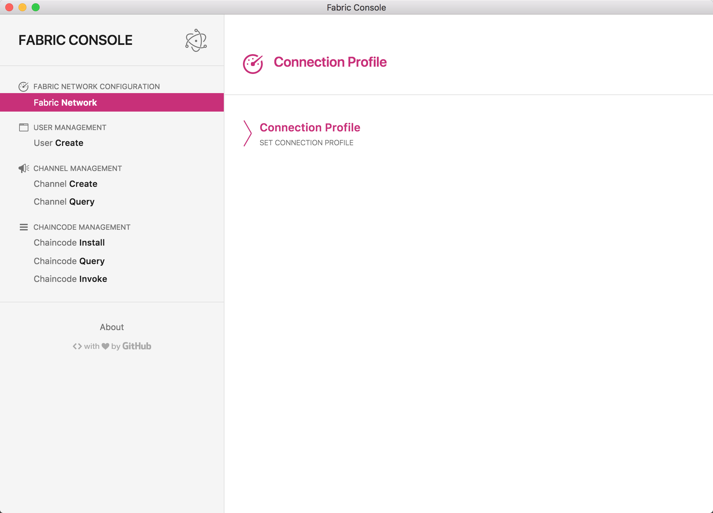

# Fabric Console 

[](http://standardjs.com)

A lightweight Hyperledger Fabric client.

Fabric Console main features:
1. Connect fabric network using connection profile.
2. User management.
3. Channel management and query.
4. Chaincode management.



Forked from [electron-api-demos](https://github.com/electron/electron-api-demos), 
which is a desktop app that interactively and with sample code demonstrates core features of the [Electron](http://electron.atom.io) API. It's built with Electron, too, of course. This app works on Windows, macOS and Linux operating systems.

## Get started

### Prerequisites

Set up [balance transfer](https://github.com/hyperledger/fabric-samples/tree/release-1.2/balance-transfer) network.

### Start Fabric Console

You'll need [Node.js](https://nodejs.org) installed on your computer in order to build this app.

```bas
$ git clone https://github.com/zhangmin510/fabric-console
$ cd fabric-console
$ npm i -g cnpm
$ cnpm i
$ ./node_modules/.bin/electron-rebuild
$ npm run dev
```

Integrate `fabric-client` with electron using `electron-rebuild`(reference: https://electronjs.org/docs/tutorial/using-native-node-modules


### Play

Use files in `artifacts` to play with fabric console.

Run [balance transfer](https://github.com/hyperledger/fabric-samples/tree/release-1.2/balance-transfer) API demo using fabric console.